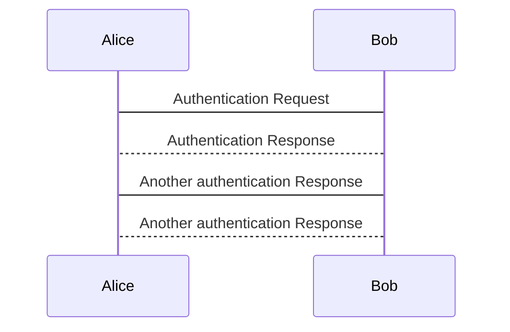

# doc-testing

```mermaid
sequenceDiagram
Alice -> Bob: Authentication Request
Bob --> Alice: Authentication Response
Alice -> Bob:Another authentication Response
Bob --> Alice: Another authentication Response
```
